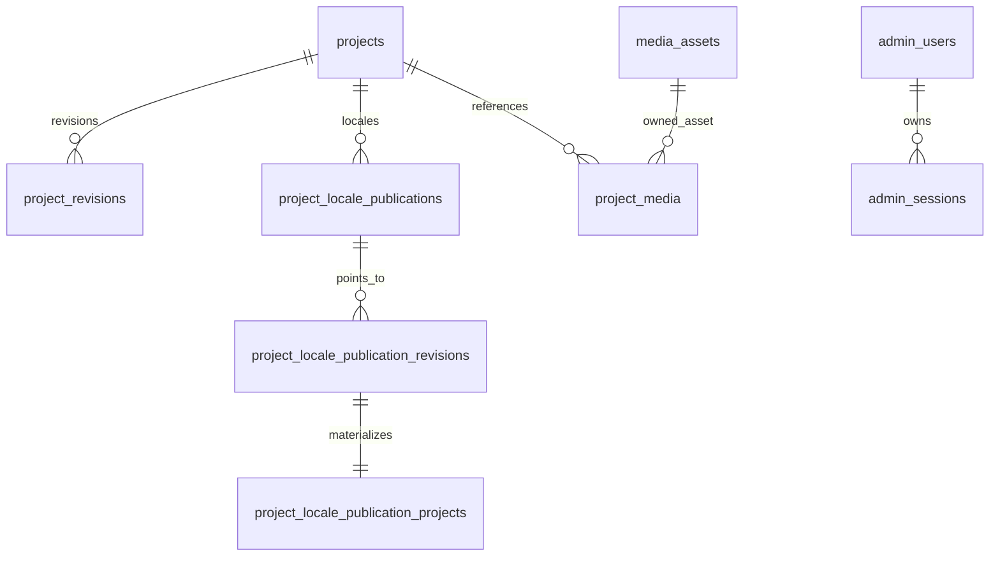

# Database map

Schema truth is `backend/drizzle/` plus `backend/src/db/schema/`. `projects` is the aggregate root with current draft/published revision pointers. `project_revisions` stores immutable revision content and unique `(project_id, revision_number)`; audit events record actions. `project_translations`, technologies, features/notes and translations, links and media are project-owned normalized content, mostly cascade from project; media asset references are restricted where publication ownership must survive.

Locale Model C uses `project_locale_publications` (per project/locale state and generation), immutable `project_locale_publication_revisions`, publication-owned project/header, features, notes, technologies, links, and media projection tables. `admin_users`, `admin_sessions`, and `auth_events` support owner auth. Drizzle journal records applied migrations. Readers/writers are repositories/services in `modules/admin-projects`, `modules/public-projects`, auth, and media.

**CURRENT IMPLEMENTATION:** these tables, migrations, services, and verifiers exist. **CRITICAL — REQUIRES TARGETED VERIFICATION:** establish production migration entry point, locale backfill invocation/idempotency, preservation of existing published projects and pointers/revisions/projections/media, plus rollback/recovery implications. No remediation is approved by this map.

